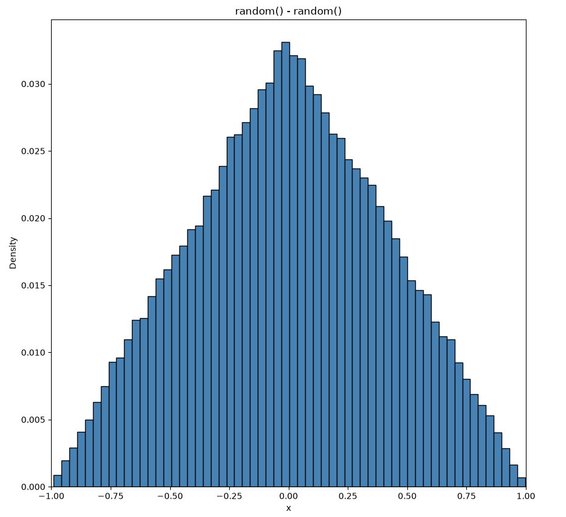
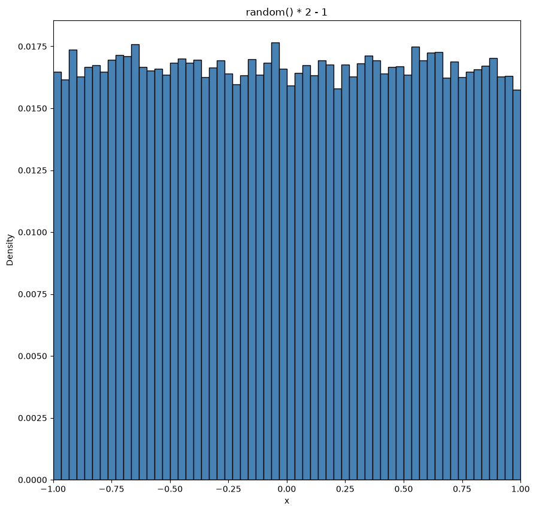
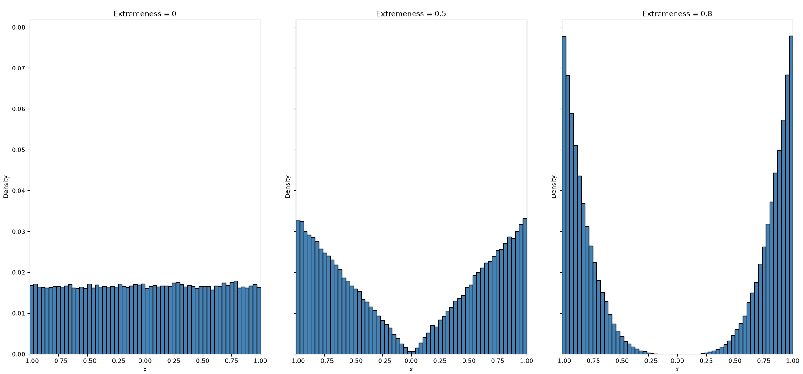
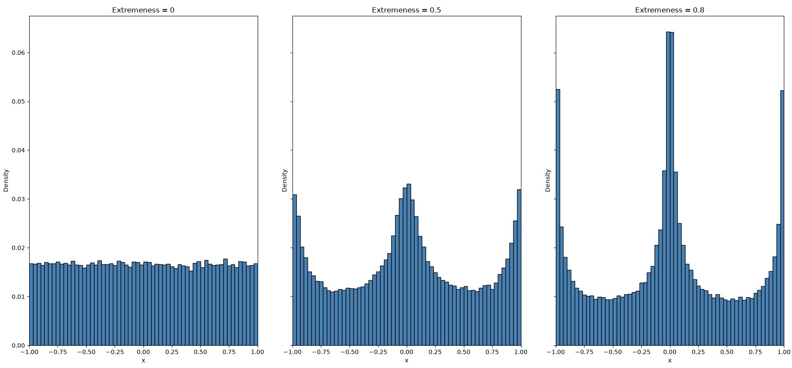
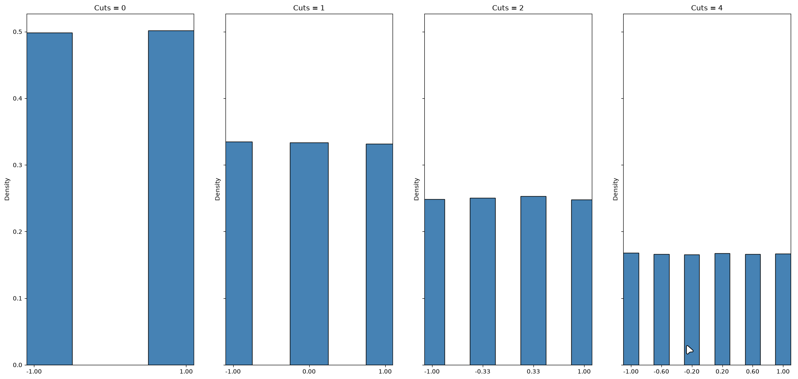

# ibcarpet

A carpet extension mod. A port of
[JoaCarpet](https://github.com/JoakimThorsen/JoaCarpet)'s insane behavior
feature to the newer version of Minecraft.

Insane behavior is used to test item entity RNG by giving user control over the
random number generator to forcibly generate highly unlikely numbers without
waiting for hours.

Currently, this extension supports item entity RNG controls over the following actions:

- Breaking minecart
- Piston breaking blocks
- Breaking containers (chest, dropper, hopper)
- Dispense RNG (dispenser, crafter, dropper)
- Projectile

## Usage

To start using IBCarpet (Insane Behaviors Carpet): `/carpet insaneBehaviors
true`. Put false instead of true if you want to turn everything off.

By default, ibcarpet uses the trimodal distribution with an extremeness value of
0.5. The distributions provided by this mod can be configured using `/carpet
ibDistribution <distributionName>`. Distributions controls how random numbers
are picked. Read the distribution description below to understand when to use
what.

## Distributions

- Minecraft default: [Triangle](#triangle-distribution)
- [Uniform](#uniform-distribution)
- [Bimodal](#bimodal-distribution)
- IBCarpet default: [Trimodal](#trimodal-distribution)
- [Discrete](#discrete-distribution)

### Triangle Distribution

This is the random number generator used by most of Minecraft's default item
entity position and velocity RNG. IBCarpet replaces these triangle distribution
random numbers with custom ones where the users can freely modify to fit their
needs. Some of the RNG replaced by IBCarpet are from a uniform distribution
instead of triangle distribution, but it does not affect the overall purpose of
IBCarpet at all.

Here's the current implementation of Minecraft's triangle distribution RNG:

```java
default double triangle(final double mean, final double spread) {
  return mean + spread * (this.nextDouble() - this.nextDouble());
}
```

`this.nextDouble()` generates a number within `[0, 1)` uniformly. `mean` and
`spread` are constants most of the time, and they are not something we need to
worry about for understanding how to use IBCarpet.

`this.nextDouble() - this.nextDouble()` is what gives the shape of the triangle
distribution. If we run this a bunch of times and collect the outputs into a
histogram where the Y-axis is the probability of numbers within that range on
the X-axis getting picked, it will look like this:



The shape looks like a triangle where the peak is at 0, and the frequency
decreases as the RNG generates numbers closer to -1 and 1. This is exactly the
behavior we see in vanilla Minecraft. For example, a dropper dispenses items into
random directions, but from time to time, there will be one or a few items that
travels further than the rest. This is due to Minecraft's RNG picking
numbers from a triangle distribution; it mimics a normal distribution (bell
curve) where values further from the center are highly unlikely to happen, but
will happen eventually given enough time.

This is the reason why insane behaviors is useful to a lot of technical
players. Instead of testing/waiting for a really long time to catch highly
unlikely events, this carpet extension allows players to catch those events
much faster.

### Uniform Distribution



All numbers are equally likely to be picked inside of this distribution. This
is useful when testing a design for a long period of time. Uniform distribution
will most likely catch all edge cases when given enough time.

### Bimodal Distribution



This distribution is the complete opposite of triangle distribution, where all
the unlikely events from the triangle distribution are likely to happen in
the bimodal distribution. This is useful to test only the very rare edge cases.

The extremeness of this distribution can be configured using `/carpet
ibBimodalExtremeness <value>`. `value` can be a number between `0` and `1`, but
can't be exactly `1`. `0` means uniform distribution and values closer to `1`
means "very extreme edges." The default extremeness value is `0.5`.

### Trimodal Distribution



This distribution is similar to bimodal, but values around -1, 0, and 1 are
more likely to happen instead of just values around -1 and 1. Bimodal
distribution is not great at covering axis-aligned extremes. For example, when
an item is dispensed from a dropper, it will pick a random velocity vector in
the X and Z axes. Bimodal can only increase the probability of both X and Z to
an extreme, it cannot increase only one axis at a time. This means, in this
case, if bimodal has a high extreme value, it's only useful for testing items
being dispensed diagonally, which can miss some edge cases that happen when
items travel parallel to the world axes.

The extremeness of this distribution can be configured using `/carpet
ibTrimodalExtremeness <value>`. `value` can be a number between 0 and 1, but
can't be 1. `0` means uniform distribution and values closer to `1` means "very
extreme edges and center." The default extremeness value is `0.5`. Note that
this value does not change the distribution as much as the bimodal extremeness
value to its distribution.

### Discrete Distribution



Unlike the other distributions, discrete distribution is not continuous. It
picks number randomly based on a pre-determined set of possible numbers. This
set of numbers can be configured using `/carpet ibDiscreteCuts <value>`. It's
better to show the pattern than explaining how discrete random numbers are
generated in IBCarpet.

Here's the pattern:

- Cut = 0, possible numbers are `[0, 1]`
- Cut = 1, possible numbers are `[0, 0.5, 1]`
- Cut = 2, possible numbers are `[0, 0.333..., 0.666..., 1]`
- Cut = 3, possible numbers are `[0, 0.25, 0.5, 0.75, 1]`

The possible numbers are like evenly slicing up a cake. The space between each
cut becomes thinner as the number of cuts increases. A value is picked from
this set of possible numbers as the generated number. As the number of cuts
approaches infinity, the distribution becomes uniform.

Discrete distribution is useful to test most of the possible edge cases very
quickly. Since it has a limited amount of possible numbers, it's very easy to
generate extreme values. Please do remember that discrete distribution can help
players to quickly generate many important and unique extreme values, but it
does not cover all possibilities.

Unlike other distributions, this one has a range of `[-1, 1]` (inclusive)
instead of `(-1, 1)` (exclusive).

The default number of cuts is `4`. Discrete distribution supersedes the
systematic method of generating random numbers used in the original JoaCarpet
extension.

## Differences between JoaCarpet

JoaCarpet generates random number similar to the discrete distribution. However,
two main differences are that discrete distribution is independent (previous
generation does not affect the current generation) and JoaCarpet is not
memoryless (has a counter that remembers how many times random has been
called). JoaCarpet's approach is to start off with the most extreme numbers: 0
and 1. When the counter reaches 1, it resets, and automatically increase the
number of cuts so that the next iteration will loop through 0, 0.5, and 1. One
major issue with this approach is that it requires manual user input to reset
the counter and the counter are shared between all item entity randomlization
events. If you have multiple droppers doing the same thing, some of the
droppers might never hit the edge cases. After leaving JoaCarpet insane
behavior running for hours, you can encounter dropper basically dispensing
items at the same location. This is because the "cuts" value is getting way too
big so the increment step between each item dispense is almost 0.
